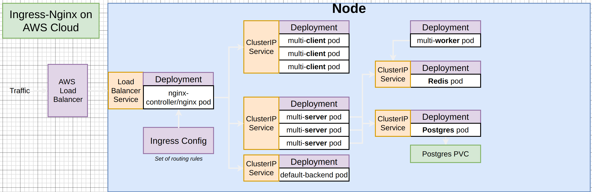
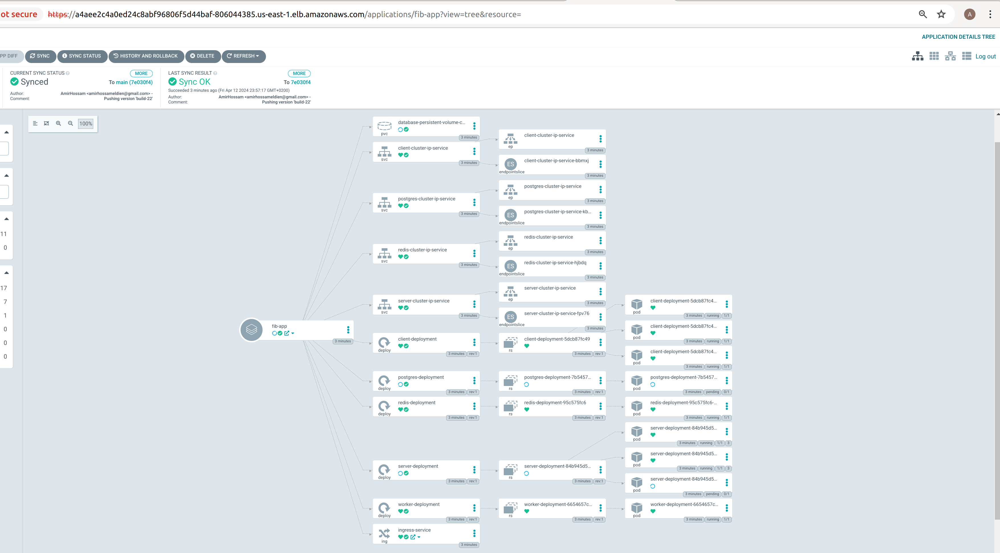
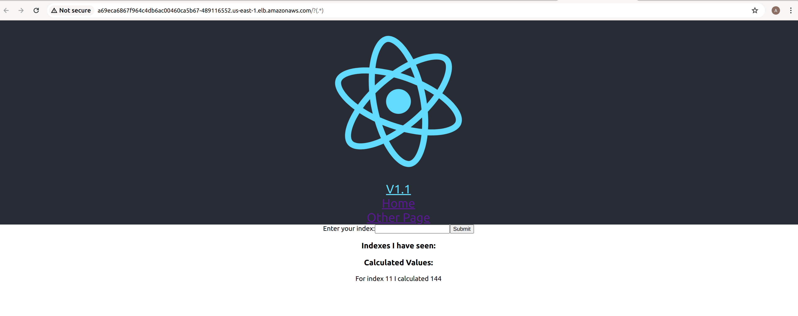
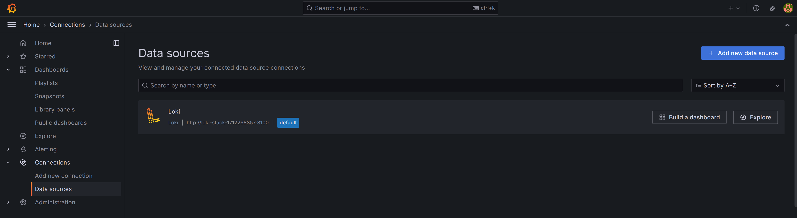
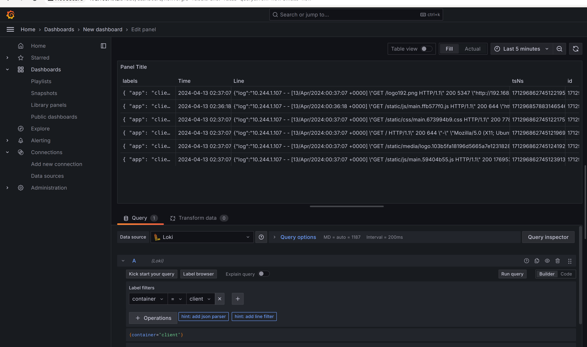

# Using GitOps (ARGOCD) to deploy kubernetes manifests to AWS EKS

### Tools that have been used in the project:

- Terraform for automating provisioning of the infrastructure
- CIRCLE-CI as a Conitinuous Integration tool for automating the Build / Testing stages.
- ArgoCD as a Continuous Deployment tool for automating Deploying the config files on AWS EKS.
- AWS
- Docker for creating Container images
- kubernetes for Managing the images
- Loki as a Logging tool for the pods
- Grafana to create dashboards for Loki
- Helm as a package manager to installing kubernetes applications
### HLD for the project


### Useful steps for installing ArgoCD on the EKS cluster:
- To interact with your cluster using Cloud Shell
`aws eks update-kubeconfig --name $CLUSTER_NAME --region $REGION`

- Install ArgoCD
`kubectl create namespace argocd`
`kubectl apply -n argocd -f https://raw.githubusercontent.com/argoproj/argo-cd/v2.4.7/manifests/install.yaml`

- The next command will create a LB service type to expose the Argo CD server for public access.
`kubectl patch svc argocd-server -n argocd -p '{"spec": {"type": "LoadBalancer"}}'`
- Then use the LB DNS to access ArgoCD

- For retrieving adming PW for ArgoCD:
`kubectl -n argocd get secret argocd-initial-admin-secret -o jsonpath="{.data.password}" | base64 -d`

- After Login , Create a new application and add your Github Repo to connect with your kubernetes manifests.

- After creating an application on ArgoCD, It detects the manifests and deploying the config files.


- Check the LB URL to access the application


----
### Useful steps for installing Loki-Stack on the EKS cluster:
- Installing Loki-Stack
`helm show values grafana/loki-stack > values.yaml`

- open the values.yaml file to modify it
` vim values.yaml`

- modify the next values:
```
grafana:
  enabled: true #Change it to true
  sidecar:
    datasources:
      label: ""
      labelValue: ""
      enabled: true
      maxLines: 1000
```
- Then 
`helm install --values values.yaml loki grafana/loki-stack`

- The next command to create a LoadBalancer for grafana to access it, The grafana serive is created as ClusterIP by default:
`kubectl patch svc $Grafana_Service  -p '{"spec": {"type": "LoadBalancer"}}'`

- To get the admin password for grafana:
`kubectl  get secret loki-stack-1712268357-grafana -o jsonpath="{.data.admin-password}" | base64 -d`

- Makesure that the loki is the data source:


- An example for monitoring the container logs:
